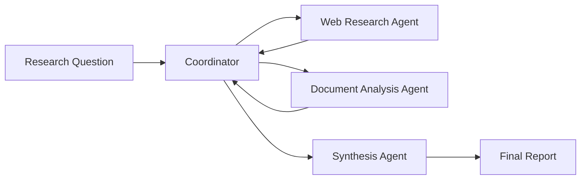
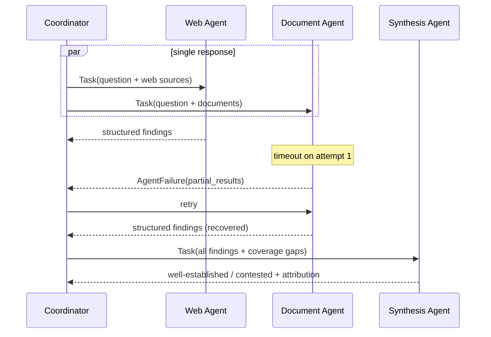

# Multi-Agent Research Pipeline

A reference implementation of a **coordinator-driven, multi-agent research
pipeline** that demonstrates agent orchestration, explicit context passing,
parallel execution, provenance tracking, structured error propagation,
conflict resolution, and reliability analysis.

The pipeline is intentionally self-contained: it uses only the Python standard
library and bundled `sample_data/`, so it runs deterministically offline. The
`prompts/` directory contains the corresponding Claude Code agent definitions
that the Python modules emulate.

---

## 1. Exercise Overview

**Objective:** design, implement, test, and document a multi-agent research
pipeline in which a coordinator delegates to specialised subagents, then merges
their structured findings into an attributed report.

The implementation demonstrates the ten required concepts:

| # | Concept | Where |
| --- | --- | --- |
| 1 | Coordinator agent | `src/coordinator.py` |
| 2 | Multiple subagents | `src/web_research_agent.py`, `src/document_analysis_agent.py`, `src/synthesis_agent.py` |
| 3 | Explicit context passing | `Coordinator.build_context` |
| 4 | Parallel task execution | `Coordinator.run_subagents` (`ThreadPoolExecutor`) |
| 5 | Structured findings | shared finding schema (content vs. metadata) |
| 6 | Provenance preservation | `src/provenance.py` |
| 7 | Error propagation | `src/error_handler.py` |
| 8 | Partial result recovery | `run_with_recovery` + `partial_results` |
| 9 | Conflict handling | `src/synthesis_agent.py` |
| 10 | Latency analysis | `src/latency_tracker.py` |

### Run it

```bash
pip install -r requirements.txt          # only pytest is required
python src/coordinator.py                # runs the pipeline, writes output/
python -m pytest tests/ -v               # runs the reliability suite
```

---

## 2. Architecture

Four agents, one orchestrator:





- **Coordinator** — owns global state (provenance tracker, error log, coverage
  gaps); delegates everything else.
- **Web Research Agent (A)** — extracts findings from web sources.
- **Document Analysis Agent (B)** — extracts evidence from documents.
- **Synthesis Agent (C)** — merges findings, resolves conflicts, preserves
  attribution.

Full details: [`architecture/agent_design.md`](architecture/agent_design.md),
[`architecture/orchestration_flow.md`](architecture/orchestration_flow.md),
[`architecture/sequence_diagram.md`](architecture/sequence_diagram.md).

---

## 3. Coordinator Design

The coordinator is the only stateful component, mirroring the Claude Code model
where the top-level agent holds context and subagents are stateless workers.

Orchestration decisions:
- **Source routing is declarative.** Each source declares `assigned_agent`, so
  the coordinator routes work without hard-coded logic.
- **Failure is isolated per agent.** Every subagent call is wrapped in
  `run_with_recovery`, so one agent's failure can never crash the run.
- **Partial results are first-class.** A failing agent returns whatever it
  gathered; the coordinator keeps it rather than discarding the whole result.
- **Synthesis is delegated, not inlined.** Conflict resolution lives in a
  dedicated subagent so the coordinator stays a pure orchestrator
  (`allowedTools: [Task]`).

---

## 4. Context Management

Subagents receive a fully-populated `context` dict — they never rely on
inheriting the coordinator's state.

```python
def build_context(self, agent_name, question, sources):
    return {
        "research_question": question,   # what to research
        "sources": sources,              # ONLY this agent's sources
        "work_seconds": self.work_seconds,
        "failure": self.failure,
    }
```

| Automatic inheritance (avoided) | Explicit passing (used here) |
| --- | --- |
| Subagent "sees" parent state implicitly | Everything needed is in the prompt/context |
| Breaks when context window resets | Works with a fresh context window |
| Hidden coupling, hard to test | Pure function of its inputs, trivially testable |
| Silent data loss when state is missing | Missing data is an explicit, visible error |

This is verified by `test_context_is_passed_explicitly_not_inherited`.

---

## 5. Structured Findings

Every finding separates **content** from **metadata**:

```json
{
  "claim_id": "source_a_claim_1",
  "content":  { "claim": "...", "evidence_excerpt": "...", "topic": "...", "value": null },
  "metadata": { "agent": "web_research_agent", "source": "...", "source_url": "...",
                "publication_date": "2025-04-15", "confidence": 0.9, "credibility": 0.88 }
}
```

Metadata always carries `source`, `publication_date`, `confidence`, and
`agent`. Separation lets provenance be validated independently of the claim,
and lets the synthesis agent group on `topic`/`value` without touching
attribution.

---

## 6. Provenance Tracking

`provenance.py` defines `ProvenanceRecord` and `ProvenanceTracker`. Every
finding produced by any agent is registered:

```json
{ "agent": "web_research_agent", "claim_id": "source_a_claim_1",
  "source": "Global AI Market Trends 2025",
  "source_url": "https://techinsights.example.com/ai-market-2025",
  "publication_date": "2025-04-15", "timestamp": "2026-06-13T23:10:01" }
```

`ProvenanceTracker.validate()` confirms that **every** finding has an
originating agent, a source locator, and a publication date. The latest run
validated **6/6 findings** with full attribution
(`output/provenance_report.json`). No synthesized finding loses its source —
the synthesis agent carries the full attribution list into every report
section.

---

## 7. Parallel Execution

Two modes share identical agent logic; only dispatch differs. Sequential calls
agents one-by-one; parallel emits all Task calls in one step
(`ThreadPoolExecutor`) and awaits them.

| Mode | Duration (s) |
| ---------- | -------- |
| Sequential | 1.0153 |
| Parallel | 0.5109 |

- **Time saved:** ~0.50 s
- **Improvement:** **~49.7%**

(Measured wall-clock from `output/latency_results.json`; the exact numbers vary
slightly per run. With two agents doing equal work, parallel ≈ max(durations)
while sequential ≈ sum(durations), so the ceiling is ~50%.) Verified by
`test_parallel_is_faster_than_sequential`.

---

## 8. Error Propagation

Subagents return **structured errors** instead of raising into the coordinator:

```json
{
  "status": "failed",
  "failure_type": "timeout",
  "attempted_query": "What are the key trends in the enterprise AI market ...",
  "partial_results": [ { "claim_id": "conflicting_source_2_claim_1", ... } ]
}
```

The coordinator's contract on receiving one:
1. **Receive** the error context.
2. **Log** it to `output/error_log.json` (one event per attempt).
3. **Retry** transient failures; on terminal failure, **continue** with the
   surviving + partial results.

The default run injects a **transient** timeout into the document agent
(fails once, recovers on retry) — so `error_log.json` records a recovered
event while the report stays complete. The terminal-failure path
(`failure_type` on every attempt) is exercised by
`test_terminal_failure_creates_coverage_gap`.

### Coverage Gaps

Terminal failures are **never hidden**. They surface in the report:

> ## Coverage Gaps
> `document_analysis_agent` unavailable due to timeout. Findings from this
> agent are limited to N partial result(s); overall confidence is reduced.

---

## 9. Conflict Resolution

The conflicting sources disagree on AI market growth (18% vs 23%), both
credible. The synthesis agent **does not choose** — it preserves both:

> ## Contested Findings
> ### Projected annual growth rate of the AI market
> Sources disagree. The synthesis agent **does not** select a single value.
> - AI Market Growth Outlook (MarketWatch Analysis): **18%**
> - Analyst_Briefing_Q2_2025.pdf: **23%**
>
> **Possible reasons for the discrepancy:** different methodologies, time
> horizons, market-scope definitions, and data samples.

By contrast, "Enterprise AI adoption is accelerating" appears in two
non-conflicting sources and is classified **well-established**. Verified by
`test_conflicting_values_are_contested_not_arbitrarily_chosen` and
`test_well_established_requires_multiple_sources`.

---

## 10. Reliability Analysis

**Strengths**
- Failures are isolated, logged, and recovered; the run never aborts.
- Provenance is validated programmatically, not by convention.
- Explicit context makes every agent a pure, testable function.
- Conflicts are surfaced honestly rather than averaged away.

**Weaknesses**
- Conflict detection relies on a shared `topic` key; semantically-equal claims
  with different topics would not be matched.
- Latency is simulated (`time.sleep`); real subagents would add network and
  model-inference variance.
- The two-agent design caps the parallel speed-up near 50%.

**Future improvements**
- Embedding-based claim clustering for conflict detection.
- Confidence-weighted synthesis and source-credibility scoring.
- A circuit breaker / backoff policy for repeated API failures.
- Streaming partial findings to the report as agents complete.

---

## 11. Validation Results

Commands executed:

```bash
python -m pytest tests/ -v      # reliability suite
python src/coordinator.py       # full pipeline
```

Test summary — **14 passed**:

```
tests/test_conflict_resolution.py ...   (3 passed) conflict handling
tests/test_error_handling.py ....       (4 passed) error propagation + recovery
tests/test_parallel_execution.py ...    (3 passed) orchestration + latency
tests/test_provenance.py ....           (4 passed) provenance + context passing
============================== 14 passed in ~1.4s ==============================
```

| Required test area | Covering test(s) | Status |
| --- | --- | --- |
| Coordinator orchestration | `test_coordinator_orchestration_produces_synthesis` | ✅ |
| Context passing | `test_context_is_passed_explicitly_not_inherited` | ✅ |
| Provenance preservation | `test_every_finding_has_full_attribution`, `test_no_synthesized_finding_loses_attribution` | ✅ |
| Parallel execution | `test_parallel_is_faster_than_sequential`, `test_both_modes_produce_same_findings` | ✅ |
| Error propagation | `test_transient_failure_is_recovered`, `test_terminal_failure_creates_coverage_gap`, `test_structured_error_carries_partial_results` | ✅ |
| Conflict handling | `test_conflicting_values_are_contested_not_arbitrarily_chosen`, `test_well_established_requires_multiple_sources` | ✅ |

Pipeline run output (`python src/coordinator.py`): 6 findings · 1
well-established · 1 contested · 2 single-source · 0 coverage gaps · 1
recovered error event · provenance valid (6/6) · ~49.7% latency improvement.

Generated artefacts live in [`output/`](output/): `findings.json`,
`synthesis_report.md`, `error_log.json`, `latency_results.json`,
`provenance_report.json`.

---

## 12. Lessons Learned

- **Explicit context beats implicit inheritance.** Treating each subagent as a
  pure function of its prompt made the whole system testable and removed an
  entire class of "the agent didn't see X" bugs.
- **Structured errors are a feature.** Returning partial results + a failure
  type turns a crash into a degraded-but-useful answer.
- **Honesty about gaps builds trust.** A report that says "this is missing"
  is more reliable than one that silently drops a failed source.
- **Don't let the synthesizer arbitrate.** Preserving both sides of a conflict
  is more truthful than picking a winner; the reader resolves it.

---

## 13. Final Conclusion

The pipeline shows that a thin, stateful **coordinator** plus stateless,
explicitly-contextualised **subagents** yields an orchestration that is fast
(parallel dispatch ~50% faster), trustworthy (every finding is attributed and
validated), and robust (failures are propagated, logged, recovered, and never
hidden). Conflicting evidence is preserved rather than flattened, and coverage
gaps are reported transparently. The result is a system whose reliability
properties are demonstrated by an automated test-suite rather than asserted —
reviewable end-to-end from this README without rerunning the project.

---

## Repository Structure

```
.
├── README.md
├── requirements.txt
├── architecture/        agent design, orchestration flow, sequence diagram
├── prompts/             Claude Code agent definitions (coordinator + 3 agents)
├── sample_data/         research question + 4 sources (2 conflicting)
├── src/                 coordinator, agents, provenance, errors, latency, report
├── output/              generated findings, report, error log, latency, provenance
└── tests/               4 reliability test modules (14 tests)
```
