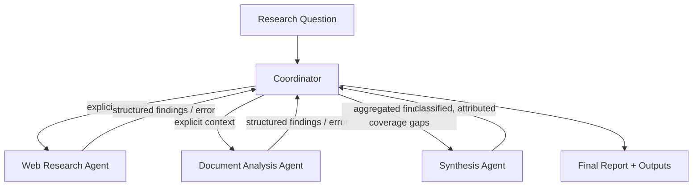

# Orchestration Flow

## Step-by-step

1. **Receive** the research question (`sample_data/research_question.txt`).
2. **Load & assign** sources. Each source declares its `assigned_agent`, so
   the coordinator routes web sources to Agent A and documents to Agent B.
3. **Build explicit context** per agent. The coordinator constructs a
   `context` dict containing the question and only that agent's sources — no
   shared/global state is assumed.
4. **Dispatch** subagents.
   - *Sequential mode:* call A, await; call B, await.
   - *Parallel mode:* dispatch A and B concurrently in one step, then await
     both.
5. **Retry & recover.** Each call is wrapped by `run_with_recovery`. A
   transient failure is retried; a terminal failure returns a structured
   error carrying any partial results.
6. **Aggregate.** Findings (including recovered partials) are merged and each
   is registered with the provenance tracker.
7. **Coverage gaps.** Any terminal failure adds a human-readable gap entry —
   failures are never hidden.
8. **Synthesize.** The coordinator hands all findings + coverage gaps to the
   synthesis agent, which classifies them into well-established / contested /
   single-source while preserving attribution.
9. **Emit outputs:** `findings.json`, `synthesis_report.md`,
   `error_log.json`, `latency_results.json`, `provenance_report.json`.

## Execution modes

| Mode | Dispatch | Wall-clock |
| --- | --- | --- |
| Sequential | one agent at a time | ≈ sum of agent durations |
| Parallel | all agents in one step | ≈ max agent duration |

Parallel execution is implemented with a `ThreadPoolExecutor`, which models
Claude Code emitting multiple `Task` calls within a single response.
