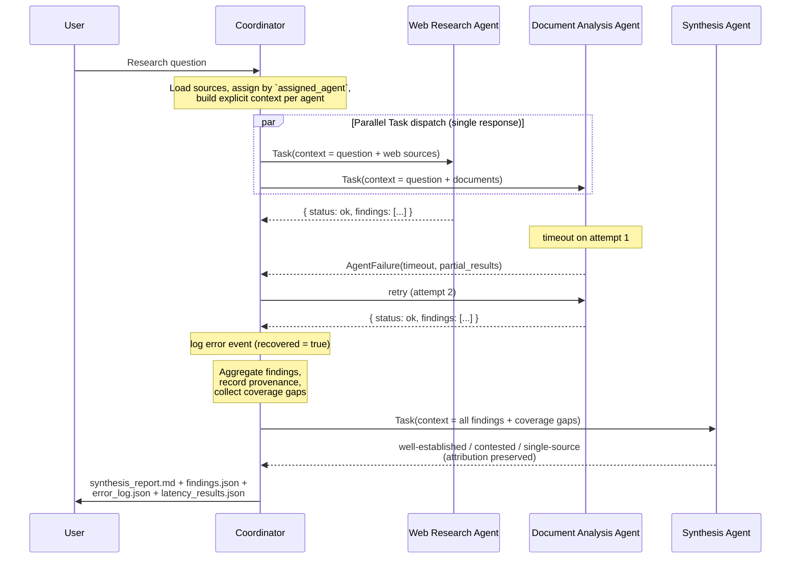

# Sequence Diagram

Shows coordinator Task calls, parallel execution, error handling, and
synthesis.

## Terminal-failure variant

If Agent B fails on *every* attempt, the coordinator:
1. Receives a structured error with `partial_results`.
2. Logs the error (`recovered = false`).
3. Adds a **Coverage Gap** entry to the report.
4. Continues synthesis using the surviving (web) findings + any partials.
